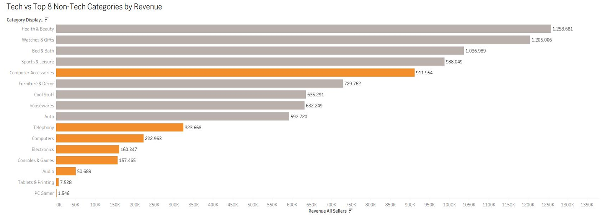
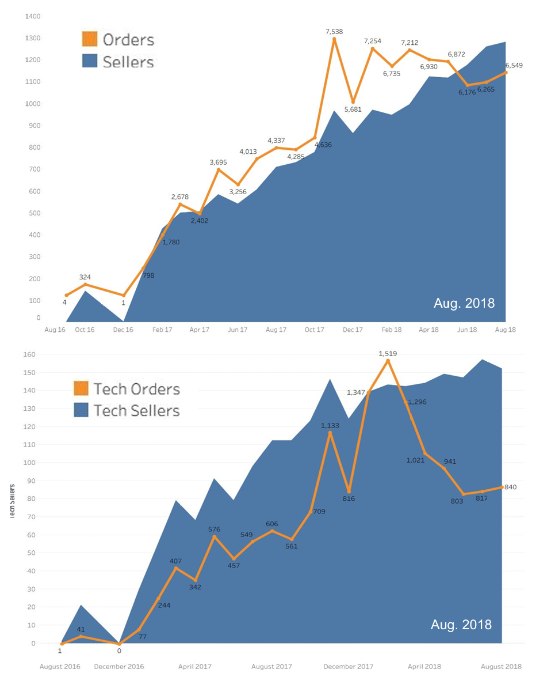
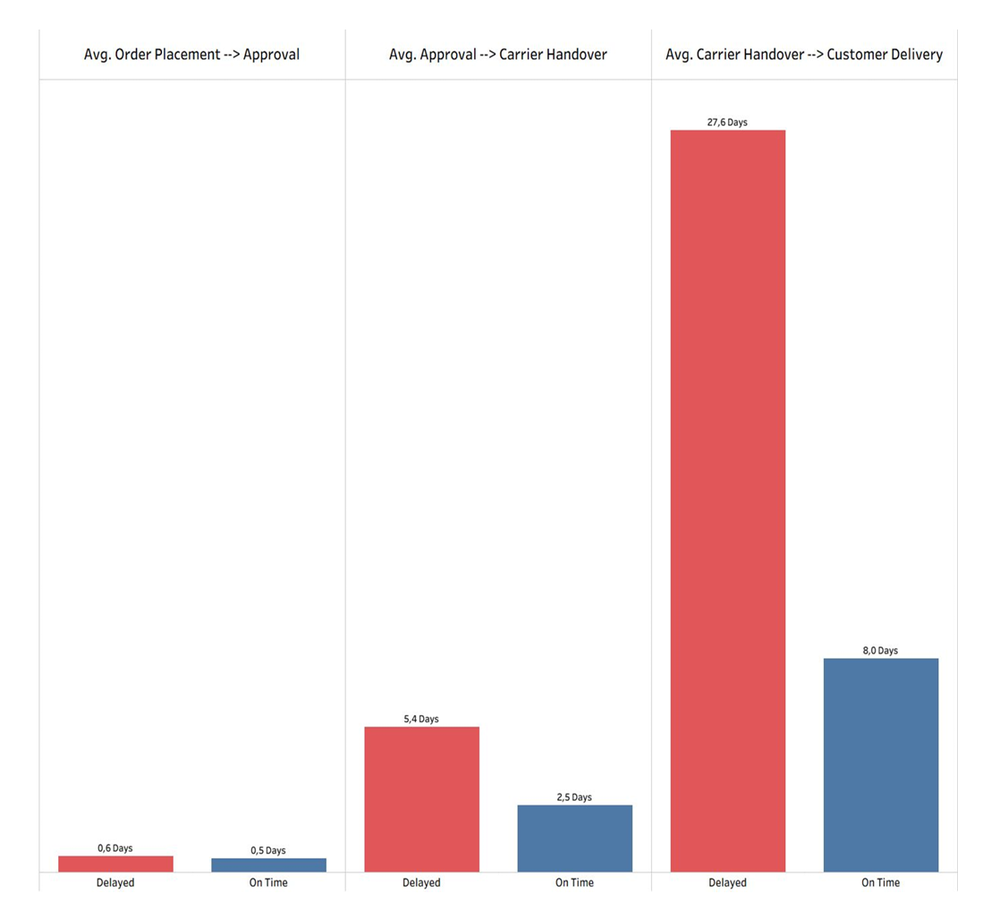

# E-commerce: Evaluating Magist as a Business Partner for Eniac through Sales, Delivery & Price Analysis 

Our team evaluated whether Magist is a suitable business partner for Eniac by analyzing order trends, delivery efficiency, and the market fit of high-priced tech products.

Due to delivery inefficiencies, stagnating tech sales, and limited demand for expensive tech products, we recommended monitoring the situation before entering a partnership. If these indicators do not improve, we advise against cooperation.

# Dataset
Source: The Magist dataset is based on the Brazilian E-Commerce Public Dataset by Olist: https://www.kaggle.com/datasets/olistbr/brazilian-ecommerce

Dataset size: ~96,500 deliveries

Key features: Sales & order analysis, tech product performance, price and market fit, delivery analysis

# Key findings & Results
- Tech products account for only 14% of Magist's total revenue (€1.84M out of €13.6M)
- Magist performs better in affordable tech products, while expensive tech products show significantly lower sales volumes
- Tech sales stagnated after December 2017, despite continued growth in the overall seller base
- Out of 96,500 deliveries, 7,800 (~8%) were delayed
- Delivery delays are a significant issue, with both Magist's handover to the postal service and the postal service itself contributing to delays

# Technologies used
Data extraction and analysis: MySQL Workbensh
Data Visualization: Tableau
Presentation: Google Slides
Machine Learning : Chat GPT

# Project structure
README: Project documentation
SQL-Code: All SQL queries used for analysis
Presentation: Final presentation

# Visualisations

Our categorisation of tech categories, comparing them to the top non-tech categories:

Seller and order growth over time:

Delivery process and delays by average:

# Future Work
A deeper look into Magist's customers: Do Magist's customers become regular customers, or do they not stay in their market?

Regional differences: Adding an analysis of regional patterns could offer a more differentiated picture.

Analysis of delivery delays over time: Do the delays get better, or is the situation getting worse?
